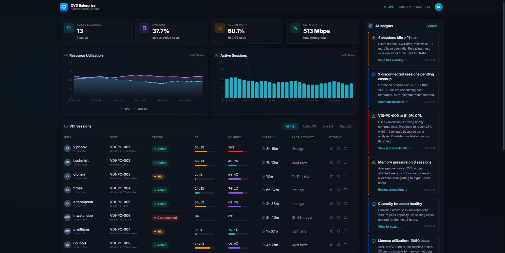

# OVD Enterprise Admin Console — AI-Powered VDI Management Dashboard

A real-time virtual desktop infrastructure (VDI) administration console with AI-driven insights, live session monitoring, and server fleet health tracking.



## Features

- **Session Management** — Live table of active VDI sessions with user details, hostname, status indicators, CPU/memory utilization, duration, and last activity timestamps. Disconnect, restart, and message controls for individual sessions.
- **Real-Time Metrics** — Live-updating charts powered by Recharts showing resource utilization trends and active session counts over time.
- **AI Insights Panel** — Contextual recommendations for session management, resource optimization, and capacity planning generated from system telemetry.
- **Server Fleet Monitoring** — At-a-glance overview of hypervisor and session manager health across the entire OVD infrastructure.
- **System Health Dashboard** — Aggregated status indicators for all infrastructure components with automatic anomaly detection.

## Tech Stack

- **React 18** with **TypeScript** for type-safe component architecture
- **Vite** for instant HMR and optimized production builds
- **Tailwind CSS** with a dark theme tuned for control-room readability
- **Recharts** for responsive, animated data visualizations
- **Lucide React** for a clean, consistent icon system

## Quick Start

```bash
npm install && npm run dev
```

Open [http://localhost:5173](http://localhost:5173) to view the dashboard.

## Live Demo

[View the live demo](https://inuvika-admin-console.vercel.app)

## Notes

- All data is simulated — no backend or API connections required.
- Sessions, metrics, and insights update automatically every 5-12 seconds to simulate a live monitoring environment.
- Optimized for desktop viewing at 1280px+ width.

---

Built as a proof-of-concept for Inuvika's OVD Administration Console Pilot project (Advance Ontario, April 2026).
